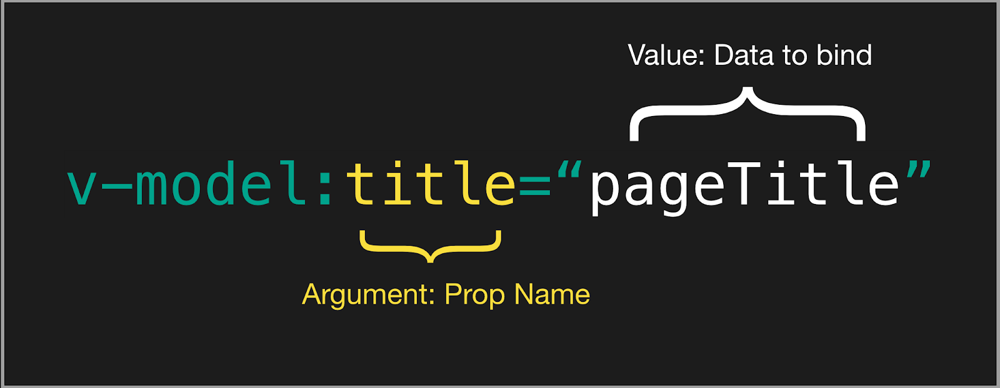

## 支持库更新

- 新版本的 Router, Devtools
- 构建工具链: Vue CLI -> Vite
- 状态管理: Vuex -> Pinia
- IDE 支持: Vetur -> Volar
- JSX: @vue/babel-preset-jsx -> @vue/babel-plugin-jsx

## v-model

- 非兼容：用于自定义组件时，v-model prop 和事件默认名称已更改：
  - prop：value -> modelValue；
  - 事件：input -> update:modelValue；
- 非兼容：v-bind 的 .sync 修饰符和组件的 model 选项已移除，可在 v-model 上加一个参数代替；
- 新增：现在可以在同一个组件上使用多个 v-model 绑定；
- 新增：现在可以自定义 v-model 修饰符。



## v-if、v-for优先级

- 3.x 版本中 v-if 总是优先于 v-for 生效

```js
<!--
 这会抛出一个错误，因为属性 todo 此时
 没有在该实例上定义
-->
<li v-for="todo in todos" v-if="!todo.isComplete">
  {{ todo.name }}
</li>
```

## v-bind

在 3.x 中，如果一个元素同时定义了 v-bind="object" 和一个相同的独立 attribute，那么绑定的声明顺序将决定它们如何被合并。

## v-on.native 移除

emits 选项允许子组件定义真正会被触发的事件，对于子组件中未被定义为组件触发的所有事件监听器，Vue 现在将把它们作为原生事件监听器添加到子组件的根元素中 

```js
<my-component
  v-on:close="handleComponentEvent"
  v-on:click="handleNativeClickEvent"
/>
```

## 函数式组件

- 非兼容：functional attribute 已从单文件组件 (SFC) 的 template 中移除
- 非兼容：{ functional: true } 选项已从通过函数创建的组件中移除

## 异步组件

- 新增 defineAsyncComponent 方法，用于显式地定义异步组件
- component 选项被重命名为 loader
- Loader 函数本身不再接收 resolve 和 reject 参数，且必须返回一个 Promise

## VNode Prop 格式化

#### 2.x语法

```js
// 2.x
{
  staticClass: 'button',
  class: { 'is-outlined': isOutlined },
  staticStyle: { color: '#34495E' },
  style: { backgroundColor: buttonColor },
  attrs: { id: 'submit' },
  domProps: { innerHTML: '' },
  on: { click: submitForm },
  key: 'submit-button'
}
```

#### 3.x语法

```js
// 3.x 语法
{
  class: ['button', { 'is-outlined': isOutlined }],
  style: [{ color: '#34495E' }, { backgroundColor: buttonColor }],
  id: 'submit',
  innerHTML: '',
  onClick: submitForm,
  key: 'submit-button'
}
```

## 插槽

此更改统一了 3.x 中的普通插槽和作用域插槽。

- this.$slots 现在将插槽作为函数公开
- 非兼容：移除 this.$scopedSlots

```js
// 在 3.x 中，插槽以对象的形式定义为当前节点的子节点：
h(LayoutComponent, {}, {
  header: () => h('div', this.header),
  content: () => h('div', this.content)
})
```

## 移除 $listeners

$listeners 对象在 Vue 3 中已被移除。事件监听器现在是 $attrs 的一部分

```js
{
  text: '这是一个 attribute',
  onClose: () => console.log('close 事件被触发')
}
```

## $attrs 包含 class & style

$attrs 现在包含了所有传递给组件的 attribute，包括 class 和 style

## 移除按键修饰符

- 非兼容：不再支持使用数字 (即键码) 作为 v-on 修饰符
- 非兼容：不再支持 config.keyCodes

```js
<!-- Vue 3 在 v-on 上使用按键修饰符 -->
<input v-on:keyup.page-down="nextPage">

<!-- 同时匹配 q 和 Q -->
<input v-on:keypress.q="quit">
```

## 移除事件api

$on，$off 和 $once 实例方法已被移除，组件实例不再实现事件触发接口

## 移除过滤器

## 移除内联模板

## 移除$children

使用ref替代

## 移除propsData

propsData 选项之前用于在创建 Vue 实例的过程中传入 prop，现在它被移除了。如果想为 Vue 3 应用的根组件传入 prop，请使用 createApp 的第二个参数。

## attribute 强制转换规则

- 移除枚举 attribute 的内部概念，并将这些 attribute 视为普通的非布尔 attribute
- 非兼容：如果值为布尔值 false，则不再移除 attribute。取而代之的是，它将被设置为 attr="false"。若要移除 attribute，应该使用 null 或者 undefined。

|绑定表达式 | foo 正常 | draggable 枚举|
|  ----  | ----  | ---- |
|:attr="null"|	-	|- *|
|:attr="undefined"|	-|	-|
|:attr="true"|	foo="true"|	draggable="true"|
|:attr="false"|	foo="false" *|	draggable="false"|
|:attr="0"|	foo="0"|	draggable="0" *|
|attr=""|	foo=""|	draggable="" *|
|attr="foo"|	foo="foo"|	draggable="foo" *|
|attr|	foo=""|	draggable="" *|

## 自定义指令

- created - 新增！在元素的 attribute 或事件监听器被应用之前调用。
- bind → beforeMount
- inserted → mounted
- beforeUpdate：新增！在元素本身被更新之前调用，与组件的生命周期钩子十分相似。
- update → 移除！该钩子与 updated 有太多相似之处，因此它是多余的。请改用 updated。
- componentUpdated → updated
- beforeUnmount：新增！与组件的生命周期钩子类似，它将在元素被卸载之前调用。
- unbind -> unmounted

## Data选项及合并规则

- 非兼容：组件选项 data 的声明不再接收纯 JavaScript object，而是接收一个 function。

- 非兼容：当合并来自 mixin 或 extend 的多个 data 返回值时，合并操作现在是浅层次的而非深层次的 (只合并根级属性)。

## 过渡的 class 名更改

- 过渡类名 v-enter 修改为 v-enter-from、过渡类名 v-leave 修改为 v-leave-from。

## 侦听数组

- 非兼容: 当侦听一个数组时，只有当数组被替换时才会触发回调。如果你需要在数组被改变时触发回调，必须指定 deep 选项。